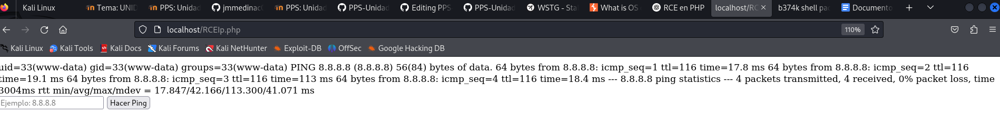
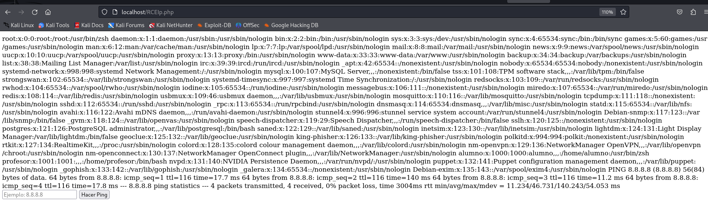
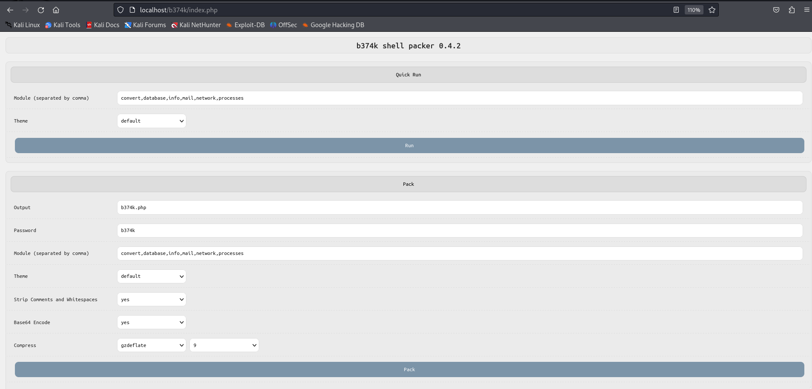
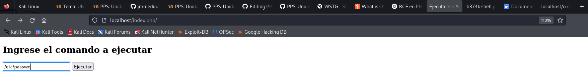
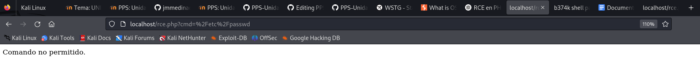
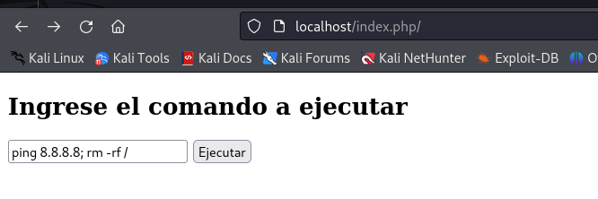
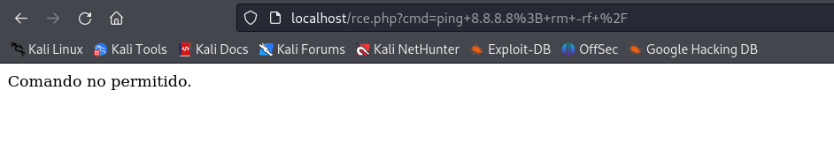
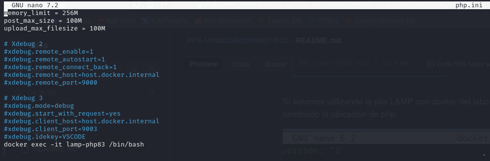

* Pruebo los comandos de inyección

* También puedo concatenar para descargar un repositorio

* Con la primera mitigación podemos ejecutar un whoami
  

* Pero si probamos con un /etc/passwd, este será el resultado

